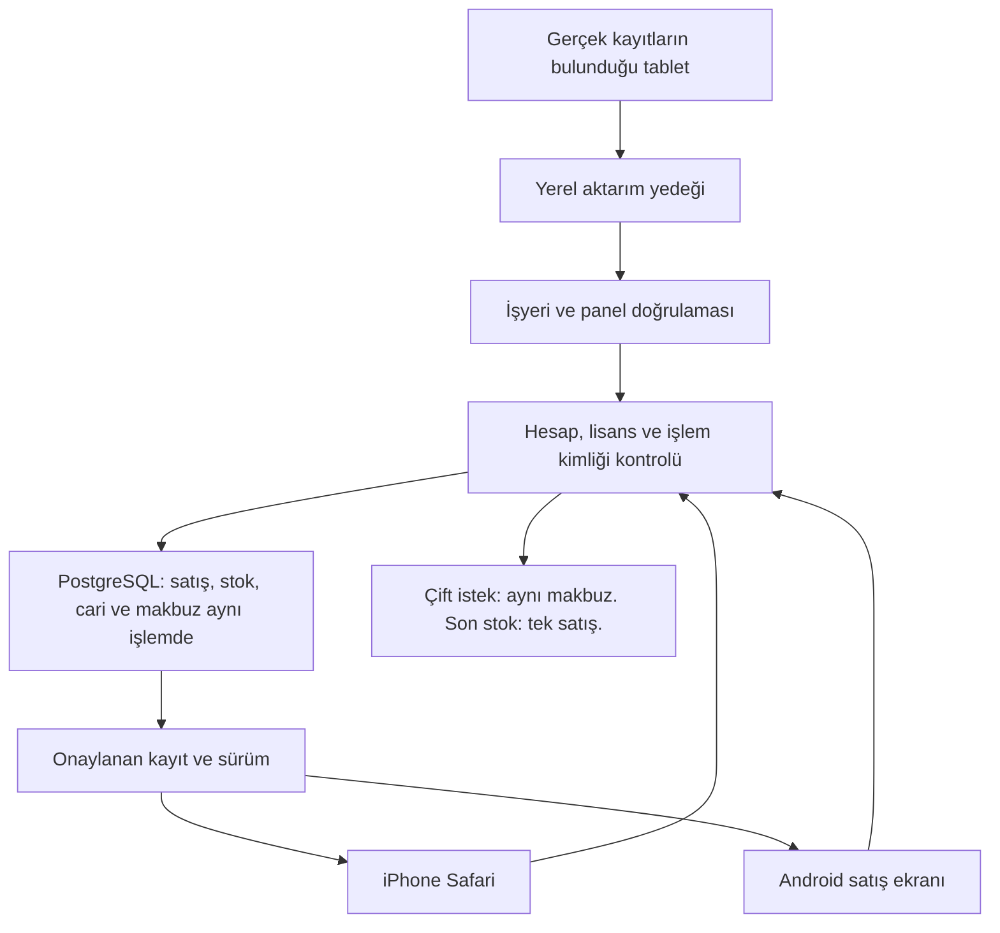

# AESD ortak kayıt şeması

```mermaid
flowchart TD
  Tablet[Gerçek kayıtların bulunduğu tablet] --> Backup[Yerel aktarım yedeği]
  Backup --> Import[İşyeri ve panel doğrulaması]
  Import --> API[Hesap, lisans ve işlem kimliği kontrolü]
  Phone[iPhone Safari] --> API
  Android[Android satış ekranı] --> API
  API --> DB[PostgreSQL: satış, stok, cari ve makbuz aynı işlemde]
  DB --> Sync[Onaylanan kayıt ve sürüm]
  Sync --> Phone
  Sync --> Android
  API --> Guard[Çift istek: aynı makbuz. Son stok: tek satış.]
```

Ortak satış internet gerektirir. İlk gerçek tablet aktarımı kullanıcı cihazında tamamlanmalıdır. Fiziksel cihaz testi yapılmadı.
